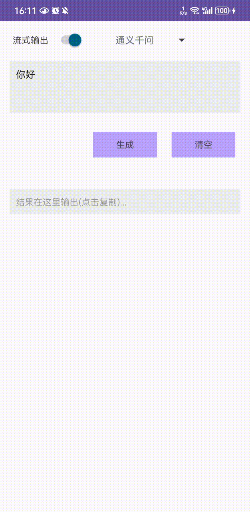

## 安卓AI接口调用示例

主要实现流式调用、打字机效果。

- 配合[后端example](https://github.com/swxctx/goai/tree/main/example)使用，如果后端不同，修改接收协议就行

- 安卓端配置

	```
	network_security_config.xml 文件修改为服务器IP（如果自己本地运行后端项目）
	NetworkService API_BASE_UTL 修改服务器地址
	```
	
- 运行效果

